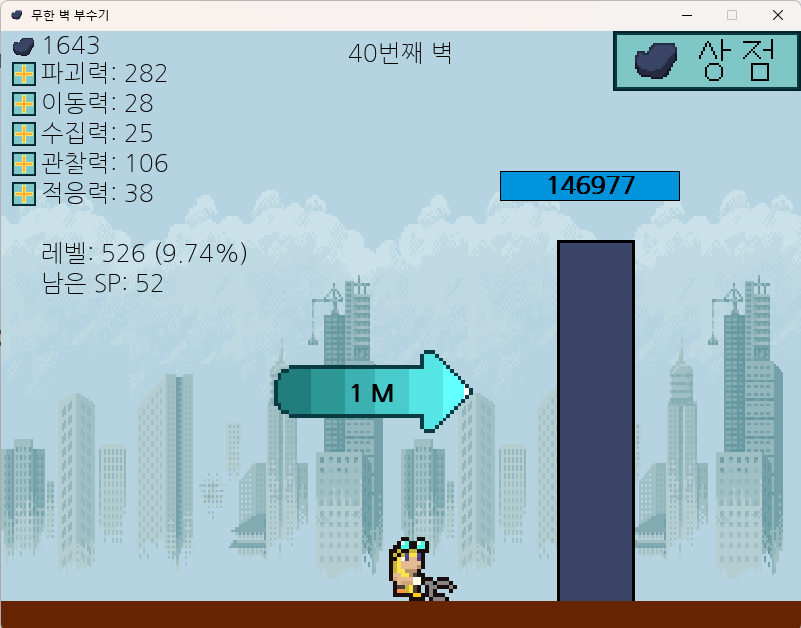
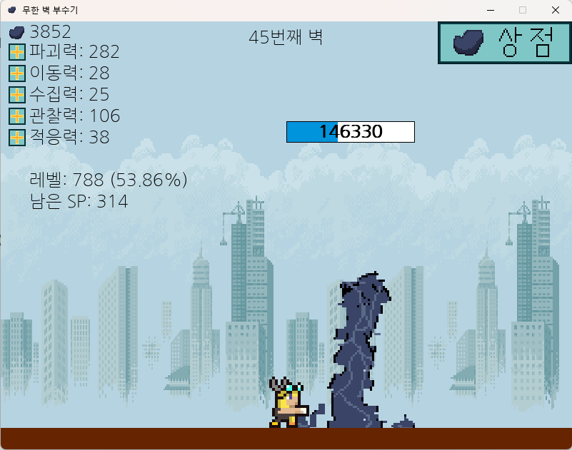
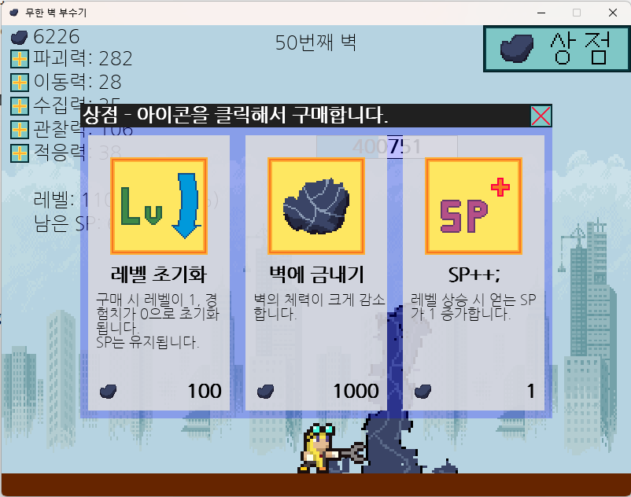
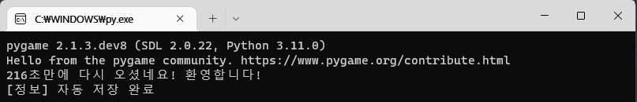
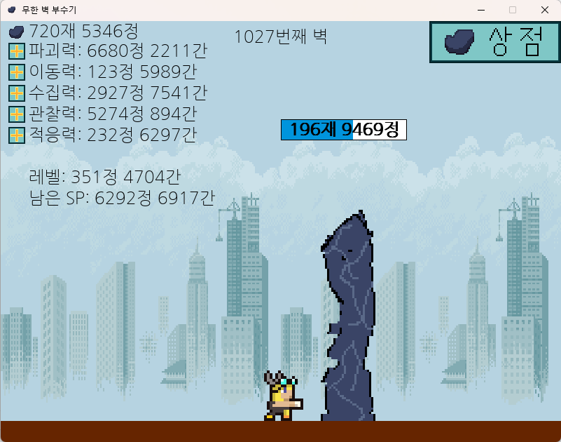

# 무한 벽 부수기

## 소개
**무한 벽 부수기**는 카구야 테이블([원 출처](https://walfas.org/?p=1133)/[플래시아크](https://flasharch.com/archive/play/370989ba6e020dcb50f8283422fa49c2))에서 영감을 받은, 
앞에 나타나는 벽이 부서지는 것을 지켜보면 되는 방치형 게임입니다.

## 권장 환경
Python 3.11.0+\
Pygame 2.1.3.dev8+\
Numpy 1.23.4+\
'[나눔고딕](https://hangeul.naver.com/font/nanum)' 글꼴 설치 *(기본 폰트를 사용할 경우 위치가 맞지 않을 수 있습니다)*

## 실행 방법
**start.py**를 실행함으로써 시작할 수 있습니다.

## 게임 상세 설명
### 기본 진행
캐릭터는 자동으로 벽을 부수며, 일정량의 돌멩이와 경험치를 얻습니다.
돌멩이를 이용하여 상점에서 아이템을 구매할 수 있으며,
경험치를 이용하여 왼쪽의 + 버튼으로 캐릭터의 스탯을 강화할 수 있습니다.

### 각 스탯 설명
- 파괴력: 벽을 부수는 위력이 증가합니다.
- 이동력: 다음 벽으로 이동하는 데 걸리는 시간이 감소합니다.
- 수집력: 벽에서 더욱 많은 돌멩이를 얻습니다.
- 관찰력: 벽에서 더욱 많은 경험치를 얻습니다.
- 적응력: 한 번에 최대로 올릴 수 있는 스탯의 양을 늘립니다.

### 상점
상점은 오른쪽 위 '상점' 버튼을 눌러 창을 열 수 있습니다.
상점 창은 자유롭게 드래그해서 움직일 수 있고, X 버튼으로 닫을 수 있습니다.
각 아이템의 아이콘을 눌러서 돌멩이로 아이템을 구매할 수 있습니다.
각 아이템은 구매 시 가격이 점점 상승합니다.

### 초반 진행 팁
- 파괴력과 관찰력을 우선 고르게 올리는 것을 권장합니다.
- 하지만 이동력과 수집력을 1로 두는 것은 좋지 않습니다. SP에 여유가 있을 때 조금씩 올려봅시다.
- 적응력을 상승시키는 것 역시 적응력의 영향을 받습니다. 너무 많이 올리면 스탯의 분배가 어려워집니다.
- 레벨 초기화는 정말 필요한 순간인지 잘 따져보고 사용하는 것이 좋습니다.

### 세이브 파일
오픈 소스 게임이므로, 세이브 파일을 단순 텍스트 파일로 저장해 쉽게 수정할 수 있습니다.
파일은 save 폴더 안 save.txt에 있습니다.

자동 저장을 지원합니다. 저장 간격은 1분입니다.

### 개발자 최고 기록
- 벽 1028개
- 이 기록은 save/save_dev.txt에 있습니다.

## 라이선스
프로그램의 소스 코드는 모두 MIT license에 따라 배포합니다.\
이미지는 별도 첨부된 라이선스 문서를 참고 바랍니다.

## 참고 자료
[Pygame documentation](https://www.pygame.org/docs/)\
[0] https://www.pygame.org/docs/tut/PygameIntro.html \
[1] https://stackoverflow.com/questions/53238491/python-pygame-mouse-position-and-which-button-is-pressed \
[2] https://stackoverflow.com/questions/20002242/how-to-scale-images-to-screen-size-in-pygame \
[3] https://www.delftstack.com/ko/howto/python/scientific-notation-python/ \
[4] https://github.com/Rabbid76/PyGameExamplesAndAnswers/blob/master/documentation/pygame/pygame_time_and_timer_event.md \
[5] https://stackoverflow.com/questions/41332861/click-and-drag-a-rectangle-with-pygame \
[6] https://stackoverflow.com/questions/34647966/how-to-express-multiple-types-for-a-single-parameter-or-a-return-value-in-docstr \
[7] https://stackoverflow.com/questions/42014195/rendering-text-with-multiple-lines-in-pygame \
[8] https://codechacha.com/ko/python-convert-string-to-list/ \
[9] https://stackoverflow.com/questions/32582733/is-there-a-python-construct-that-is-a-dummy-function
